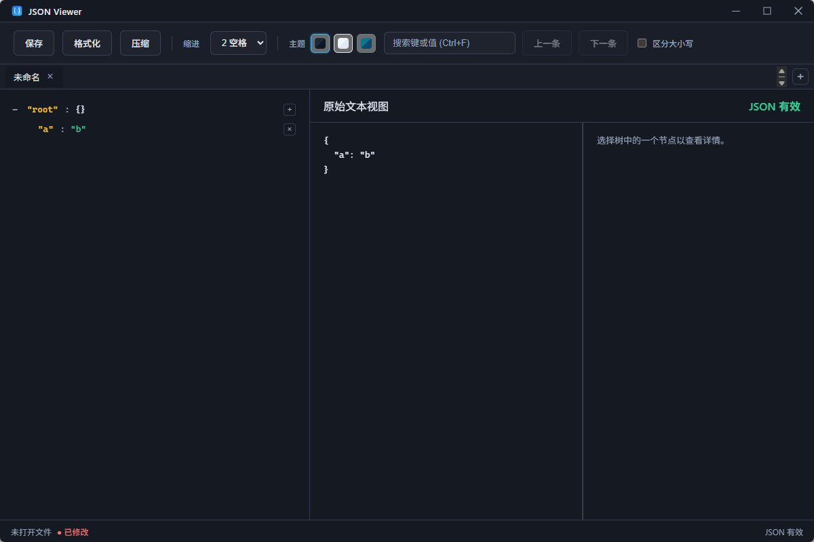

# JSON Viewer 桌面版 JSON 阅读器（Tauri + Vue 3 + TypeScript）

一个跨平台桌面端 JSON 阅读 / 编辑工具，基于 **Tauri 2 + Vue 3 + TypeScript** 实现，专注于「**一眼看懂 JSON 结构，快速定位并编辑需要的字段**」。

### 界面预览



- 左侧：树形结构视图，按对象 / 数组分层展示，并显示子节点数量  
- 中间：原始文本视图，支持格式化 / 压缩、缩进风格切换（2 空格 / 4 空格 / Tab）  
- 右侧：节点详情区（选中树节点后展示更多信息）  
- 顶部工具栏：保存、格式化、压缩、缩进、主题切换、搜索（支持 Ctrl+F）  
- 底部状态栏：当前文件状态（未打开 / 已修改）与 JSON 是否有效

### 主要特性

- 加载本地 JSON 文件（文件对话框 / 拖拽到窗口 / 右键“打开方式”）
- 树形结构查看 JSON，支持折叠/展开、子项计数提示，自动滚动到当前选中节点
- JSON 格式化 / 压缩，一键切换缩进风格（2 空格 / 4 空格 / Tab），并记住用户偏好
- 节点值编辑（字符串、数字、布尔、null），实时校验并给出报错位置
- 原始 JSON 文本同步编辑与实时校验（错误行列直接高亮）
- 关键字搜索（键名/值），支持大小写敏感、上一条 / 下一条结果导航
- 支持保存 / 另存为 JSON 文件，避免破坏原始数据

### 快速上手（作为使用者）

1. 启动应用后，点击窗口左上方的 **“打开”** 按钮，或直接将 `.json` 文件拖拽进窗口  
2. 在左侧树中展开需要关注的节点，或按 `Ctrl+F` 搜索键名 / 值快速定位  
3. 双击节点值即可就地编辑；右侧原始文本和底部状态栏会实时反馈 JSON 是否有效  
4. 编辑完成后，点击工具栏的 **“保存”** 或 **“另存为”** 持久化到本地文件

---

## 环境要求

- Node.js ≥ 18
- Rust 工具链（stable，支持 Tauri 2）
- 平台支持：
  - Windows 10 及以上
  - macOS 10.15 及以上
  - 主流 Linux（如 Ubuntu、Fedora）

> 如首次使用 Tauri，可参考官方文档安装系统依赖（如 Windows 上的 MSVC、WebView2 等）。

---

## 安装依赖

在项目根目录（`E:\Workspace\jsonview` 或你的克隆目录）执行：

```bash
npm install
```

这会安装前端依赖（Vue / Vite / Pinia / Tauri CLI 等）。

---

## 开发模式运行（本地调试）

开发模式会同时启动：

- Vite 前端开发服务器（热更新）
- Tauri 桌面应用（加载 Vite 开发页面）

在项目根目录执行：

```bash
npm run tauri:dev
```

运行成功后会自动弹出桌面应用窗口，你可以：

- 点击顶部工具栏的 **“打开”** 选择本地 `.json` 文件
- 或直接将 `.json` 文件从资源管理器 / Finder 中拖拽到窗口中

> **重要**：必须用 `npm run tauri:dev` 或打包后的 exe 运行，**不要**用 `npm run dev`（仅 Web 预览，无“打开方式”、拖放、快捷键等桌面功能）。工具栏右侧 **“诊断”** 按钮可查看启动参数，用于排查“打开方式”是否传入路径。

### 开发时常用操作

- 修改 `src/` 下的前端代码会自动热更新（Tauri 窗口会自动刷新内容）
- 修改 `src-tauri/` 下的 Rust 代码后，Tauri 会重新编译并重启应用

---

## 打包构建（生成安装包 / 可执行文件）

项目已经在 `src-tauri/tauri.conf.json` 中配置了应用名称、窗口大小和打包目标。

### 1. 仅构建前端（生成静态资源）

如果你只想构建 Web 端静态资源（调试用），可以执行：

```bash
npm run build:web
```

这会在 `dist/` 目录下生成前端打包产物。

### 2. 构建桌面应用安装包（推荐）

标准的 Tauri 打包流程为：

```bash
npm run build
```

该命令会执行：

1. `vite build`：构建前端，输出到 `dist/`
2. `tauri build`：使用 `dist/` 中的前端资源，打包为桌面应用

打包完成后，生成的可执行文件 / 安装包会出现在：

- **Windows**：`src-tauri/target/release/jsonview.exe`（可直接运行），以及 **NSIS 安装包** `src-tauri/target/release/bundle/nsis/JSON Viewer_0.1.0_x64-setup.exe`
- macOS：`src-tauri/target/release/bundle/dmg/` 或 `.app`
- Linux：`src-tauri/target/release/bundle/deb/`、`AppImage` 等

> **Windows 安装包说明**：构建时会先运行 `scripts/ensure-nsis-windows.ps1`，在 `src-tauri/target/.tauri/` 下预下载 NSIS 工具（含重试与较长超时），避免 Tauri 内置下载超时。安装包会生成在 `bundle/nsis/` 目录下。

> 如果你只想单独运行 Tauri 构建（已经手动执行过 `vite build`），也可以：
>
> ```bash
> npm run tauri:build
> ```

---

## 功能一览与使用说明

- **打开 JSON 文件**
  - 点击工具栏“打开”按钮，选择 `.json` 文件
  - 或将 `.json` 文件拖拽到窗口，即可自动加载
- **树形浏览与折叠**
  - 左侧树视图展示 JSON 对象/数组结构
  - 点击 `+/-` 折叠/展开节点，折叠时会显示子节点数量 `(X 项)`
- **编辑节点值**
  - 对字符串/数字/布尔/null 节点：双击值进入编辑模式
  - 输入合法 JSON 片段（如 `"hello"`、`123`、`true`、`null`），回车或失焦保存
  - 非法输入会提示错误并回退
- **原始文本编辑与验证**
  - 右侧“原始文本视图”可以直接编辑完整 JSON 文本
  - 实时使用 JSON 解析校验，错误信息会显示在编辑器头部与状态栏
- **缩进设置**
  - 工具栏提供：`2 空格 / 4 空格 / Tab`
  - 切换后会即时重新格式化当前 JSON 显示
  - 用户选择会保存在本地，下一次启动沿用
- **搜索与导航**
  - 工具栏右侧输入搜索词并回车，可在键名和字符串值中匹配
  - “上一条 / 下一条”在所有匹配项之间循环跳转
  - 每次跳转会自动展开相关节点并滚动到可视区域

---

## 目录结构（简要）

```text
jsonview/
  package.json          # 项目配置与脚本
  tsconfig.json         # TypeScript 配置
  vite.config.ts        # Vite 配置
  index.html            # 前端入口 HTML

  src/
    main.ts             # Vue 入口
    App.vue             # 页面布局与 Tauri 拖拽处理
    styles.css          # 全局样式

    types/json.ts       # JsonValue / JsonNode 等类型定义
    services/
      jsonParser.ts     # JSON 解析与验证、树构建
      formatter.ts      # 缩进与格式化
      searchService.ts  # 搜索逻辑
      fileService.ts    # 调用 Tauri 命令操作文件
    store/
      useJsonStore.ts   # Pinia Store：文件状态、缩进、验证、搜索等
    components/
      Toolbar.vue
      SearchPanel.vue
      JsonTreeView.vue
      JsonNode.vue
      JsonEditorPanel.vue
      StatusBar.vue

  src-tauri/
    Cargo.toml          # Rust / Tauri 依赖配置
    build.rs            # Tauri 构建脚本
    tauri.conf.json     # Tauri 应用配置（窗口、打包等）
    src/
      main.rs           # Tauri 入口，open/save JSON 命令实现
```

---

## 创建 GitHub 仓库并启用自动构建

### 1. 初始化 Git（若尚未初始化）

```bash
git init
git add .
git commit -m "Initial commit"
```

### 2. 用 GitHub CLI 创建仓库并推送（推荐）

1. 安装 [GitHub CLI](https://cli.github.com/) 并登录：`gh auth login`
2. 在项目根目录执行（仓库会创建在当前登录的 GitHub 账号下）：

```powershell
# Windows PowerShell（公开仓库，仓库名 jsonview）
.\scripts\create-github-repo.ps1 -RepoName jsonview -IsPrivate $false

# 或私有仓库
.\scripts\create-github-repo.ps1 -RepoName jsonview -IsPrivate $true
```

Linux/macOS 可用：

```bash
chmod +x scripts/create-github-repo.sh
./scripts/create-github-repo.sh jsonview        # 公开
./scripts/create-github-repo.sh jsonview private  # 私有
```

若不用脚本，可手动执行：

```bash
gh repo create jsonview --public --source . --remote origin --push --description "JSON Viewer - 跨平台 JSON 桌面阅读/编辑工具 (Tauri + Vue 3)"
```

### 3. 启用自动构建（GitHub Actions）

- 仓库已包含 `.github/workflows/build.yml`，会在以下情况自动构建并生成 **Draft Release**：
  - 推送到 `main` 或 `release` 分支
  - 或在 Actions 页手动触发（workflow_dispatch）
- 构建产物：Windows (x64)、macOS (Intel + Apple Silicon)、Linux (x64) 的安装包/可执行文件，会上传到该次运行的 Release 草稿中。
- 若提示权限不足：在仓库 **Settings → Actions → General** 中，将 **Workflow permissions** 设为 **Read and write permissions**。

### 4. 发布版本

- 每次自动构建会创建带版本号的 Tag（如 `v0.1.0`）和 Draft Release。
- 在 **Releases** 页打开对应草稿，检查附件后点击 **Publish release** 即可对外发布。

---

## 开发建议

- 如果你要扩展功能（如：添加/删除节点、虚拟滚动、大文件优化等），推荐从 `src/store/useJsonStore.ts` 和 `src/components/JsonNode.vue` 入手。
- 如要调整 UI 风格，可以在 `styles.css` 中统一修改样式，或引入你熟悉的 Vue UI 组件库（如 Naive UI、Element Plus 等）。

